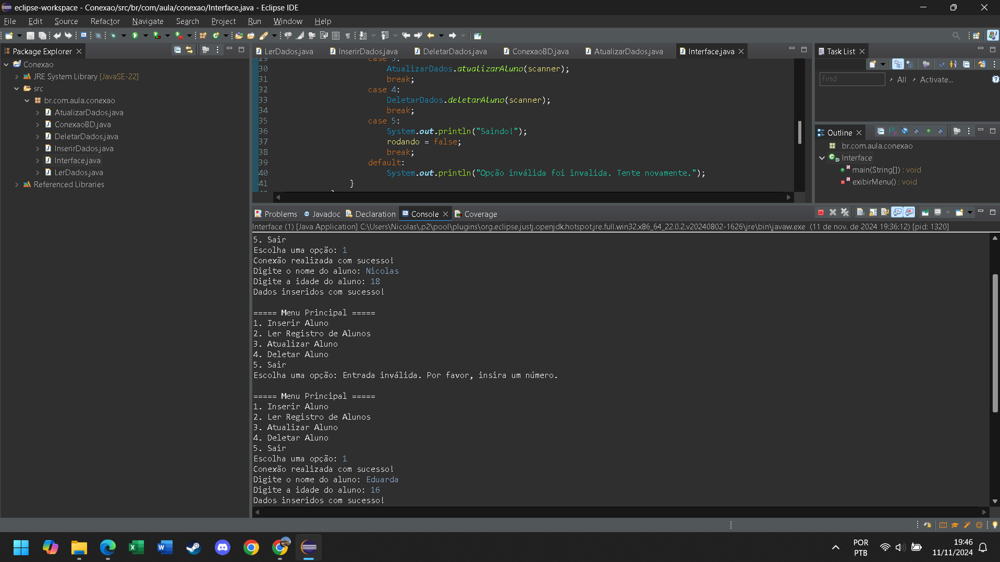
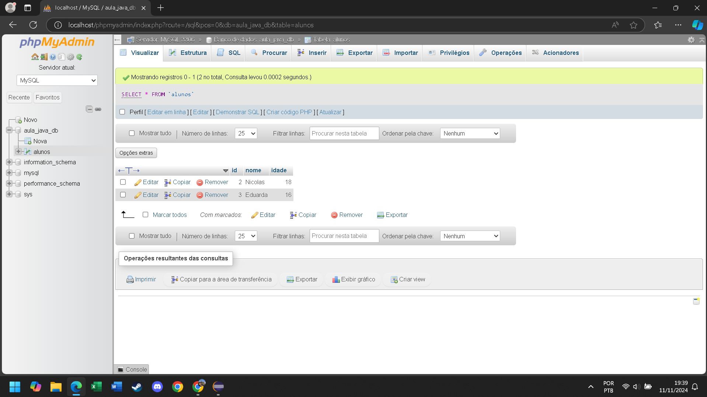
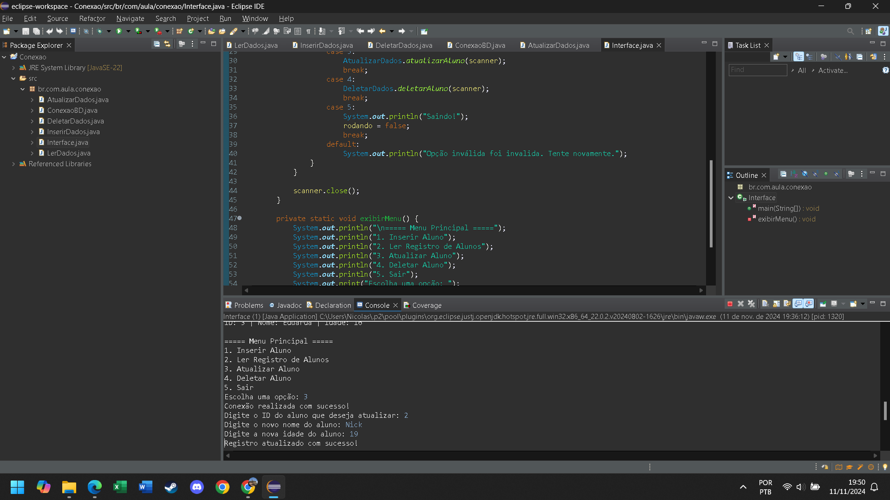
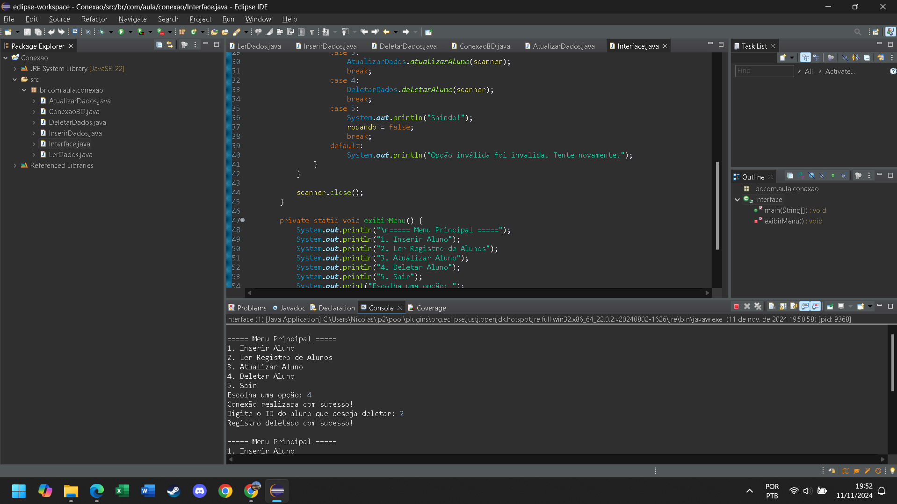
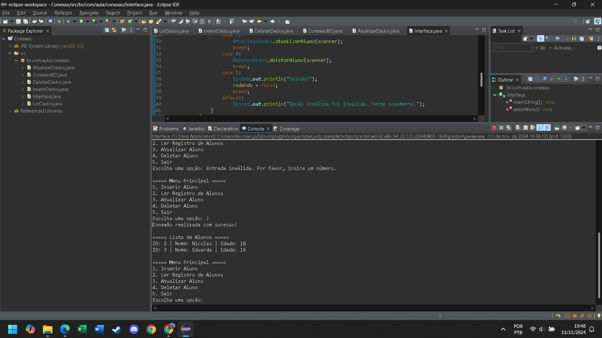
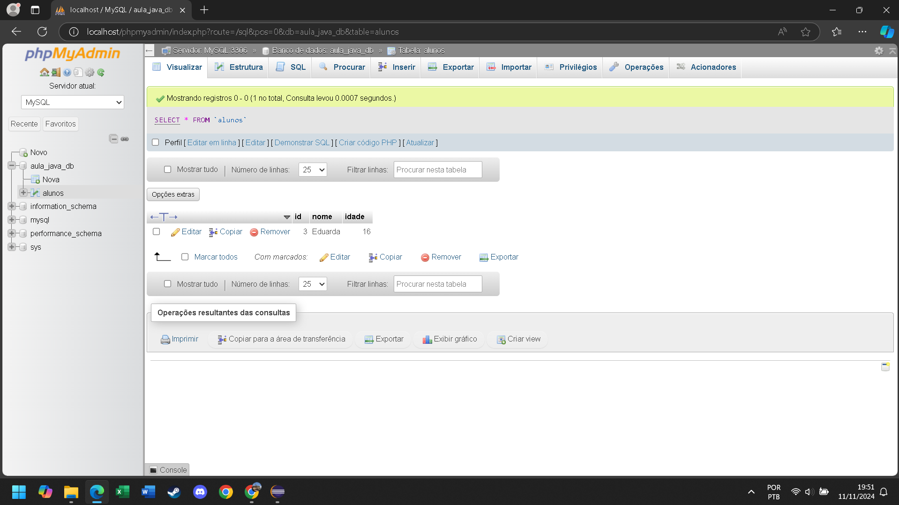

# Lista de Exercícios - JDBC

## 🚀 Começando

*ETAPA 1*
* CRIE UM PROJETO EM JAVA E REPRODUZA O EXEMPLO DO SOBRE O TEMA DA AULA DE JDBC;
* NO EXEMPLO, SERÁ NECESSÁRIO UTILIZAR O WAMP PARA ACESSO DO BANCO DE DADOS MYSQL, CONFIRA INFORMAÇÕES NO CONTEÚDO DA AULA 11 - WAMP;
* APÓS A CONFIGURAÇÃO DO AMBIENTE, CRIE AMBAS AS CLASSES DE CONEXÃO E INSERÇÃO DE DADOS;
* AO TÉRMINO CRIE UM REPOSITÓRIO REMOTO COM NOME CONEXAOBD;

*ETAPA 2*
* APÓS O TÉRMINO DA PRIMEIRA ETAPA CRIE AS SEGUINTES CLASSE:
* ATUALIZARDADOS; DELETARDADOS; LERDADOS.
* CADA CLASSE TEM UMA FUNÇÃO PARA O PROJETO;
* TESTE O PROJETO E SEU FUNCIONAMENTO;
* TESTE O FUNCIONAMENTO DE CADA CLASSE CRIADA, PARA ISSO COMPILE A CLASSE E CONFIRA NO CONSOLE E NO PHPMYADMIN;
* A CADA MODIFICAÇÃO NO BANCO TIRE UM PRINT DA TELA E INSIRA NO README.MD;
* POR FIM, CRIE UMA INTERFACE NO ESTILO INTERFACE COMMAND-LINE PARA O SEU PROJETO, A INTERFACE DEVE SEGUIR ESTE, PADRÃO:

* Inserindo os alunos

* Alunos Inseridos

* Atualizando os alunos

* Deletando os alunos

* Lendo Registro

* Aluno Deletado

## 🛠️ Construído com

* EclipseIDE

## 📌 Versão

* **Versão 1.0** 

## ✒️ Autores

* **Nicolas Beloto Armenio** - *JDBC* 
